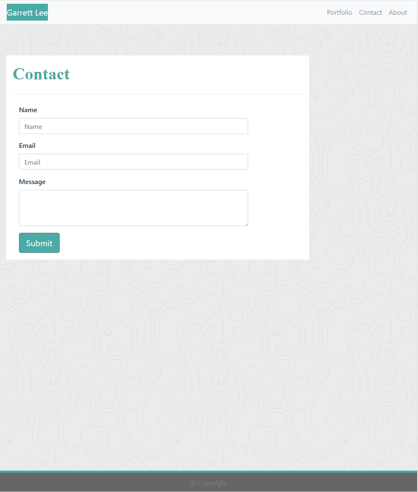

# My Responsive Portfolio Website ###

## Bootstrap

To assist in a quick and efficient design, I used bootstrap to build the website. Bootstrap is a massive database of premade classes and elements that you can build a functioning, responsive website in a fraction of the time it takes to write out all the code yourself.

## Responsive Design

My portfolio website was designed with multiple devices in mind. Breakpoints are the points at which a website shifts in design to accomadate different screen sizes and devices. I designed the responsiveness around the three breakpoint sizes:
- **Large** - Roughly equivalent to the size of a laptop screen and the breakpoint is at a width greater than or equal to 992 pixels.
- **Medium** - The size of many tablet screens and the breakpoint is at a width of 768 pixels.
- **Small/Extra Small** - Contains the size of many mobile devices. The breakpoint is at 576 pixels, with anything greater than 576, but less than 768 is classified as small and less than 576 is extra small. I designed the website's smallest size around 400 pixels keeping the smaller devices in mind.

## Div Tag Replaced

The 'div' tags were reordered and replaced with HTML semantic elements: 
  - **header** - Contains a heading element for the entire page or within another parent tag.
  - **nav** - Containing all the elements of the navbar at the top of the window.
  - **figure** - Tag in general for images; all portfolio images are contained in figure tags.
  - **section** - A portion of a page/larger section.
  - **article** - Tag contains things that could be displayed independantly of the rest of the page and still make sense.
  - **footer** - The footer/bottom of the page.

## Website Link
[My Website!](https://rgl10d.github.io/my-portfolio/)

## License
MIT License

Copyright © [2020] [Garrett Lee]

Permission is hereby granted, free of charge, to any person obtaining a copy
of this software and associated documentation files (the "Software"), to deal
in the Software without restriction, including without limitation the rights
to use, copy, modify, merge, publish, distribute, sublicense, and/or sell
copies of the Software, and to permit persons to whom the Software is
furnished to do so, subject to the following conditions:

The above copyright notice and this permission notice shall be included in all
copies or substantial portions of the Software.

THE SOFTWARE IS PROVIDED "AS IS", WITHOUT WARRANTY OF ANY KIND, EXPRESS OR
IMPLIED, INCLUDING BUT NOT LIMITED TO THE WARRANTIES OF MERCHANTABILITY,
FITNESS FOR A PARTICULAR PURPOSE AND NONINFRINGEMENT. IN NO EVENT SHALL THE
AUTHORS OR COPYRIGHT HOLDERS BE LIABLE FOR ANY CLAIM, DAMAGES OR OTHER
LIABILITY, WHETHER IN AN ACTION OF CONTRACT, TORT OR OTHERWISE, ARISING FROM,
OUT OF OR IN CONNECTION WITH THE SOFTWARE OR THE USE OR OTHER DEALINGS IN THE
SOFTWARE.

